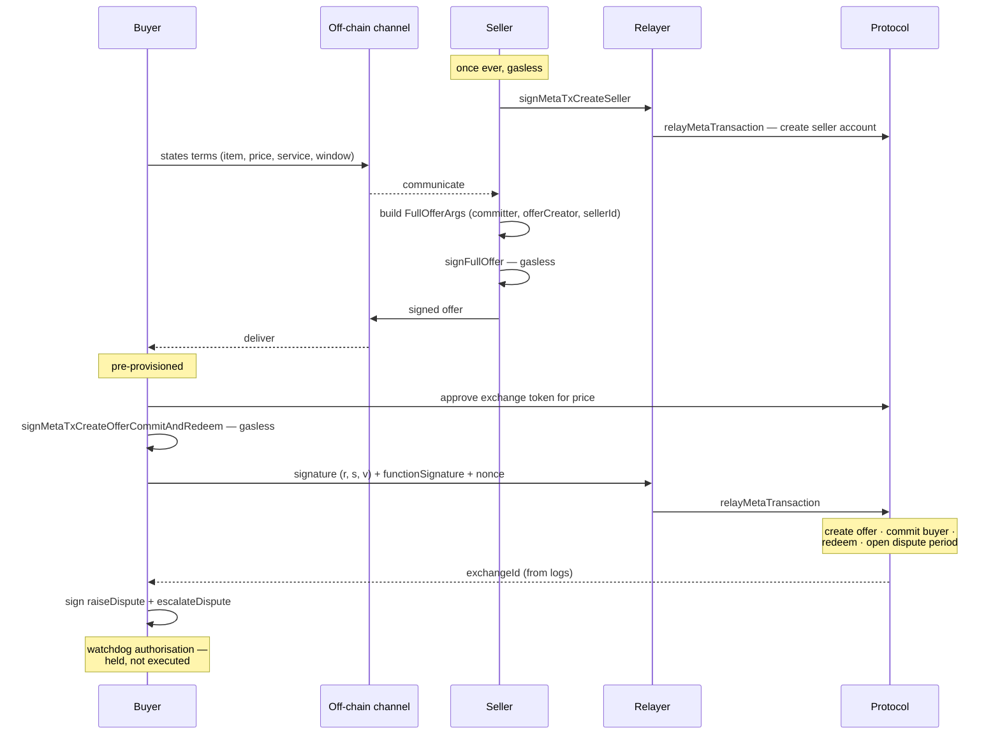

# Spec — the offer model

How an agreement between a buyer and a seller becomes an on-chain exchange.

This is the entry point to every other flow in the system. Everything downstream — the tracking
oracle, the watchdog, evidence assembly, the mediator and the case clerk — operates on the
`exchangeId` this produces and is otherwise independent of it.

---

## 1. The model

**The seller signs the offer off-chain. The buyer submits it on-chain, in a single transaction that
creates the offer, commits the buyer to it, and redeems it atomically.**

Two properties follow, and both are requirements rather than side effects:

- **Nothing exists on-chain until the buyer accepts.** There is no listing step. The seller does not
  publish anything, and no offer is visible on-chain before the moment of purchase.
- **The buyer's entire on-chain footprint is one signature.** The buyer never sends a transaction,
  never holds native currency, and never pays gas. The transaction is relayed as a
  meta-transaction on the buyer's behalf.

Negotiation is **buyer-led**: the buyer states what they want — item, price, delivery service,
delivery window — and the seller's signed reply *is* the offer. This is a property of how the two
parties communicate, not of the protocol; the protocol sees a seller-created offer either way.

### Why not buyer-signed

The protocol also supports the mirror flow, in which the buyer signs the offer and the seller submits
it. It is rejected for three reasons:

1. It requires the **seller** to send a gas-paying transaction from a funded wallet, rather than
   merely signing. That is strictly more work for the party we assume is least equipped for it.
2. It requires the buyer to deposit the item price into protocol escrow **before** the seller acts,
   so the buyer's funds sit encumbered with no exchange attached to them.
3. That intermediate state needs its own user-facing state — waiting for the counterparty, with a
   withdrawal path — which the buyer interface deliberately does not have.

A seller account is required on-chain in **both** flows, so neither avoids seller setup.

---

## 2. Sequence

| # | Actor | Call | Cost to actor |
|---|---|---|---|
| — | Seller | `signMetaTxCreateSeller` → `relayMetaTransaction` | gasless, once ever |
| 1 | Buyer | states terms off-chain | — |
| 2 | Seller | build `FullOfferArgs` — `committer` = buyer address, `offerCreator` = seller address, `sellerId`, `creator: OfferCreator.Seller` | — |
| 3 | Seller | `signFullOffer({ fullOfferArgsUnsigned })` → `signature` | gasless |
| 4 | — | signed offer travels to the buyer off-chain | — |
| — | Buyer | `approveErc20Token(exchangeToken, price)` | pre-provisioned |
| 5 | Buyer | `signMetaTxCreateOfferCommitAndRedeem({ createOfferAndCommitArgs, nonce })` | gasless |
| 6 | Relayer | `relayMetaTransaction({ functionName, functionSignature, nonce, sigR, sigS, sigV })` | one transaction |
| 7 | — | `getCommittedExchangeIdFromLogs(receipt.logs)` → `exchangeId` | — |
| 8 | Buyer | sign a `raiseDispute` and an `escalateDispute` meta-transaction for this `exchangeId` | gasless |

After step 6 the exchange is in state `REDEEMED` with `redeemedDate` set: the offer exists, the buyer
is committed, the voucher is redeemed, the seller is obliged to fulfil, and **the dispute period is
open**.

> ⭐ **Step 8 is not optional, and it cannot be moved earlier.** The deadline logic in
> [`tracking-state-mapping.md`](./tracking-state-mapping.md) §4 acts on the buyer's behalf, and the
> protocol requires those two calls to come from the buyer. The service therefore holds **pre-signed
> authorisations**, never a key — and it cannot sign them in advance, because `exchangeId` does not
> exist until step 6 is mined.
>
> **The buyer signs three times in total**: the purchase, and the two authorisations that let the
> system protect them afterwards. All three are gasless. An exchange without step 8 is unprotected,
> and must be shown as such.

> ⚠️ **Redeem fires at purchase, not at delivery.** Redeem is the buyer exercising the right to
> receive the item — it is not a confirmation that anything arrived. The dispute period starts
> counting from the moment of purchase, which is why its duration must cover shipping *and*
> inspection. See §3.

---

## 3. Offer parameters

Five values are load-bearing. Getting any of them wrong either breaks a stated property of the system
or makes offer creation fail outright.

| Parameter | Value | Requirement |
|---|---|---|
| `sellerDeposit` | `0` | Any non-zero value obliges the seller to deposit funds into escrow *before* the buyer can commit, which reintroduces a gas-paying step for the seller and breaks the signature-only property in §1 |
| Dispute resolver fee for the exchange token | `0` | Same reason. A non-zero fee must be funded before commit |
| `disputePeriodDuration` | `(delivery_timeline_days + 14) days` | Must cover shipping **and** inspection, because the period opens at purchase. This is the window the watchdog measures against |
| `resolutionPeriodDuration` | 3 days | Starts when a **dispute is raised**, not at purchase. It is the window in which the two parties settle between themselves. ⚠️ **If it lapses with no resolution, the seller is paid** — the same asymmetry as the dispute period, one level down |
| `voucherRedeemableFrom` | ≤ now | The atomic redeem in step 6 reverts if the voucher is not yet redeemable |

> ⭐ **Both periods bound the automated deadline logic**, which is specified in
> [`tracking-state-mapping.md`](./tracking-state-mapping.md) §4. Its two thresholds must each be
> **materially smaller** than the period they guard. If the escalation threshold approaches
> `resolutionPeriodDuration`, every dispute escalates the moment it is raised, the parties never get
> the chance to settle between themselves, and the cheap path stops existing.

> ⚠️ **The protocol enforces minimums and maximums on both periods.** Read them from protocol config
> rather than assuming — a short period chosen for testing can fall below the floor and be rejected at
> offer creation.

**Exchange token: an ERC-20** (USDC on Base). Native currency is not usable here — a meta-transaction
cannot forward `msg.value`, so the gasless buyer path in §1 requires a token the protocol can pull
against an allowance.

> ⚠️ **Take the token address from the dispute resolver's fee schedule.** An offer is only valid if
> its `exchangeToken` matches a token the dispute resolver lists. Read it from the resolver rather
> than from configuration written by hand, and never from a block explorer.

---

## 4. Dispute resolver

Every offer names a dispute resolver, which is a registered on-chain role. Held operates its own —
**the LX Foundry dispute resolver** — so that the human decision at the top of the escalation ladder
belongs to a resolver that can be inspected on-chain, and so that the choice of resolver is visibly a
choice rather than an assumption. Resolvers are permissionless to register, and parties agree one up
front as part of the offer.

Its configuration has four requirements:

| Field | Requirement |
|---|---|
| `fees` | Lists the exchange token used by offers, at `feeAmount: 0` |
| `sellerAllowList` | **Empty.** A non-empty allow list restricts which sellers may name this resolver |
| `escalationResponsePeriod` | Set explicitly; it bounds how long the resolver has to respond to an escalated dispute |
| `assistant` / `admin` / `treasury` | The operator's wallet |

**Verification before use.** After registering a resolver, create one throwaway offer against it and
discard it. A successful creation is the only reliable evidence that the fee schedule, allow list and
account state are all correct.

**Fallback.** If the resolver is unavailable or misconfigured, name any other resolver registered on
the **same protocol configuration** whose fee schedule lists the exchange token at zero, or register
a replacement — registration is permissionless. Either way it is a single parameter change.

⚠️ **Resolver ids are only meaningful alongside a protocol configuration id.** The protocol is
deployed to several configurations, including more than one on the same chain, and the same numeric
id names unrelated resolvers on different ones. **Never record or discuss a resolver id without its
configuration id.**

⚠️ **Changing configuration is not a fallback.** Seller accounts, exchange ids and the pre-signed
authorisations in §2 are all scoped to the configuration that created them and do not exist on
another. Moving between configurations re-provisions everything.

---

## 5. Pre-provisioning

The following exist before any exchange is created, and are not part of any runtime flow:

- Seller wallet, and its Boson seller account
- Buyer wallet, funded with the exchange token
- Buyer's ERC-20 allowance to the protocol
- The dispute resolver account (§4)

Wallet creation, account onboarding and funding are explicitly out of scope for this system. There is
no seller-side interface: **the seller side is scripted**, and exchanges used for demonstration are
created ahead of time rather than during a live session, so that no demonstrated step depends on
network availability at the time it is shown.

---

## 6. Invariants

1. **No offer is published on-chain before the buyer accepts.** Any change that introduces a listing
   step contradicts §1.
2. **The buyer never sends a transaction and never holds native currency.** Any path that requires
   the buyer to hold gas is a defect.
3. **The purchase interaction produces three signatures**: the atomic purchase, and the two scoped
   authorisations the deadline logic later relays. Losing the third is losing the protection.
4. **The seller's only on-chain obligations are one account creation and zero transactions
   thereafter.** `sellerDeposit` and the resolver fee stay at zero.
5. **`exchangeId` is the only handle passed downstream.** No component below this spec depends on how
   the exchange was created.
6. **The buyer-facing interface never names any of this.** No offer, commit, redeem, voucher, rNFT,
   escrow, wallet or exchange appears in a user-visible string, including error messages.
